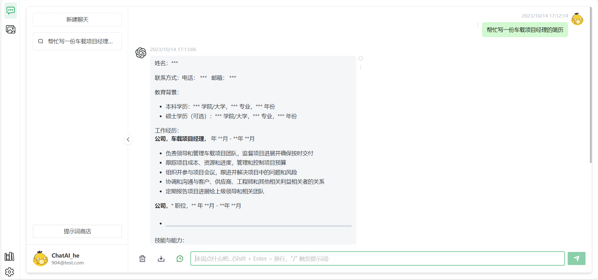
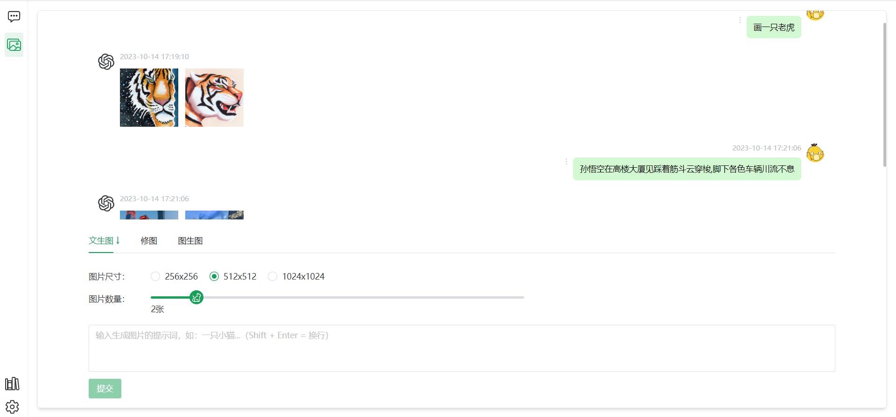
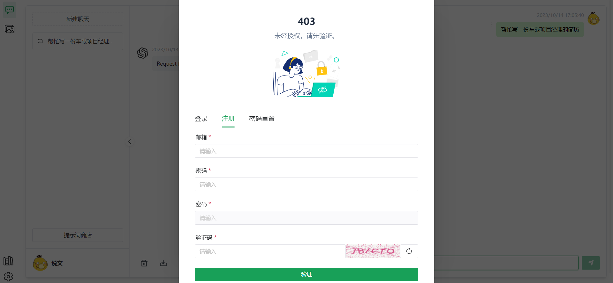
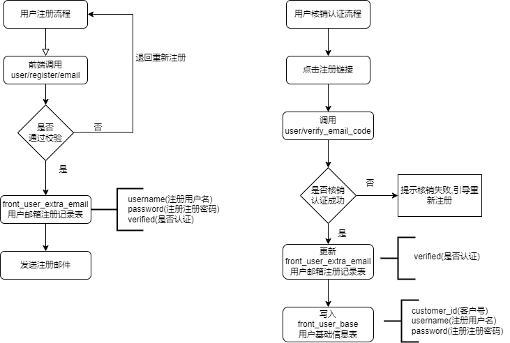

# chatgpt-django
基于django搭建的chatgpt后台服务
项目体验地址:  [网页Dmeo](https://wiki.hichat.shop/)
体验账号/密码:  demo1@demo.com/demo20240209

# ✨ 介绍
基于的 [chatgpt-web](https://github.com/Chanzhaoyu/chatgpt-web) 二次开发，适配[后台 chatgpt-django](https://github.com/old-eight800/chatgpt-django)，后续版本开发会在此项目上更新上线新功能

配套的前端项目 [chatweb](https://github.com/old-eight800/chatweb)


# 💡 页面截图

聊天页面



绘画页面



登录注册页面



# ⏺️ 简易注册流程介绍




# 🔨构建运行

## 💾 环境准备


```shell
1. # 克隆项目
git clone https://github.com/old-eight800/chatgpt-django.git
2. # 进入项目
cd chatgpt-django

3. # 填写init.sql文件的配置项
目前没有兜底api-key,请按要求填写自己的api-key

4. # django数据库初始化
python manage.py makemigrations

5. # django数据库迁移同步
python manage.py migrate

6. # 使用docker-compose启动
docker-compose up -d 
```